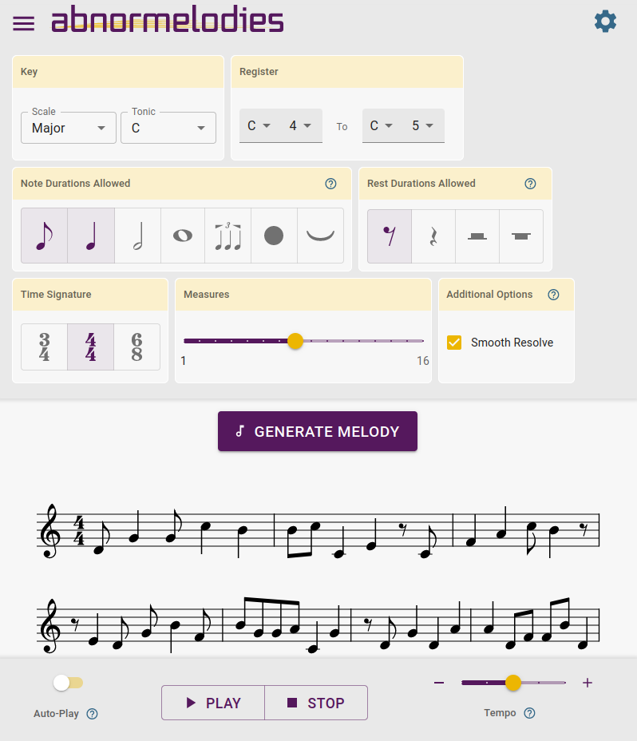
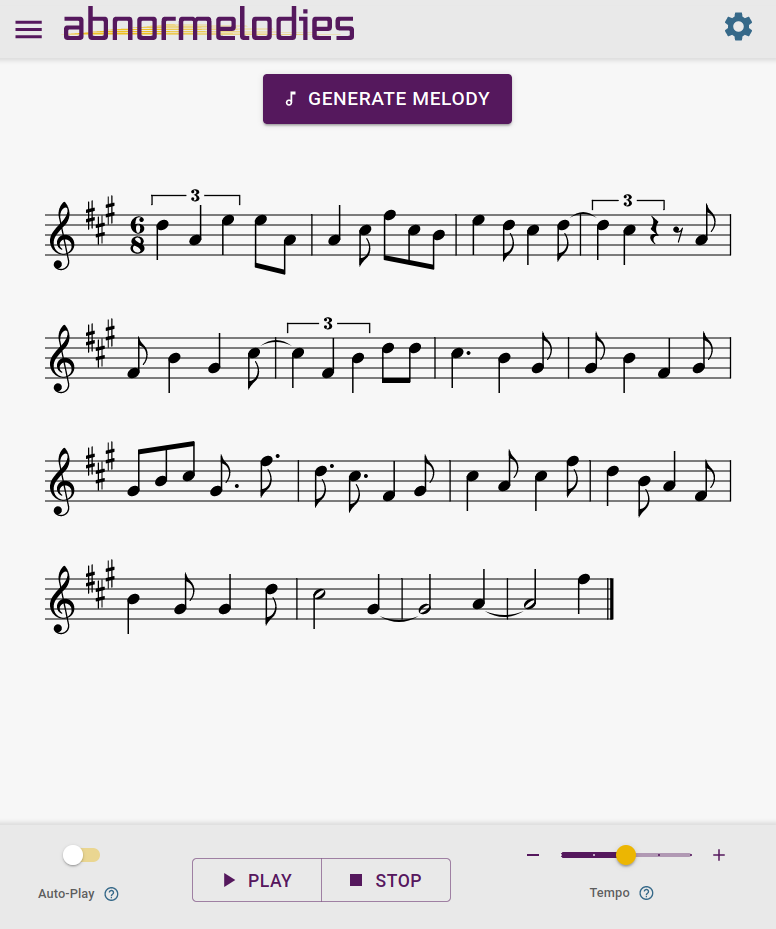
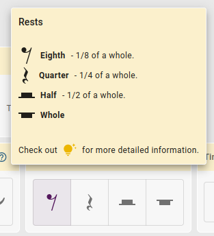
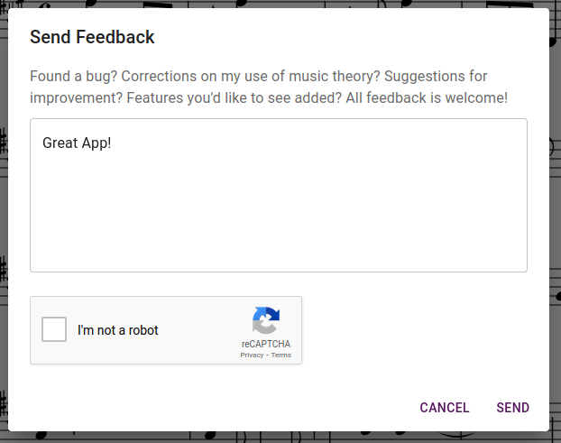
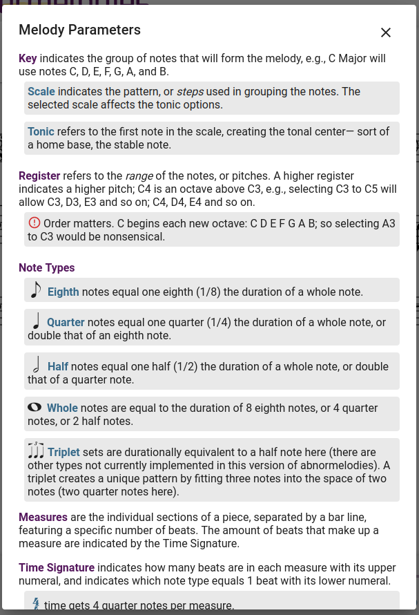

# abnormelodies - UI

This app was created for use with my abnormelodies API, a melody generator that responds with musicXML describing the tone and notational qualities of a melody. Using awesome libraries like ToneJs and OpenSheetMusicDisplay, I'm able to easily present the melody with sound and sighted notation.

This project began with the purpose of inspiring song writers in the melody creation process. With "random", unusual, and sometimes bizarre output-- the idea is that even one measure could trigger something inside the writer, a new direction to take.

It has evolved to be very accessible to the non-muscian. With my implementation of this UI, it is now also a fun playground for anyone interested in melody creation, and even an educational tool with the addition of a guide describing the function of each melody parameter.

### Accessing The App

Check it out live: [abnormelodies.com](https://abnormelodies.com)

If you're interested in the API it uses, you can read about it here: [abnormelodies - API](https://github.com/technikka/Abnormelodies_API_README)

## Technologies Used
* React 18.2.0
* Material UI
* [ToneJs](https://github.com/Tonejs/Tone.js)
* [OpenSheetMusicDisplay(OSMD)](https://github.com/opensheetmusicdisplay/opensheetmusicdisplay)
* [axios](https://github.com/axios/axios)
* [react-google-recaptcha](https://github.com/dozoisch/react-google-recaptcha)
* [react-xml-parser](https://github.com/matanshiloah/xml-parser)
* [uniqid](https://github.com/adamhalasz/uniqid)

## Description

Some of the features currently implemented include:

* A decent array of melody parameters: select scale, register range, note durations and augmentations to allow, rest durations to allow, time signature, number of measures to create, and additional rules to apply.

* The form component (melody parameters), can expand or collapse to the users preference. The Generate Melody button lives outside the form, and the audio controls live in a fixed component at the bottom of the viewport, so a user can collapse the form and continue using the app's core functionality.

* Tempo setting currently allows for 5 different speeds of playback.

* Auto-play feature can be selected so that new melodies will automatically begin playing when generating.

* An app menu includes a guide explaining the music theory behind the melody parameter selections, and a feedback form for users to inform me of bugs, suggestions, etc.

* Fully responsive for small mobile to wide display.

* Tooltips are located inside popover components (requiring a click, to be mobile compatable).

* Full keyboard and screen-reader support with the exception of the guide (see known-issues section below).

#### Screenshots

  
  
  

  
  
  

## Known Issues

* Crackling and popping sound while playing melody. This is a known performance limitation of older devices. So far this has been documented on Samsung Galaxy Note 8. A work-around is to use an external speaker, which removes the disturbance.

* Screen-readers will not speak the guide modal. This has been a challenging and confusing issue. I'm still not sure if the problem lies within the MUI components I'm using, or my understanding of ARIA, or what else. I'll continue working to understand the issue.

### What's Next

What you're likely to see with the next release:

* Interactive melodies. Measures will be individual objects with drag and drop functionality. Drag measures around to re-arrange an existing melody or with the implementation of shelves, they can be dropped onto a shelf for later use. These tools will make it possible to create a melody from many bits of different generated melodies.

* User account for saving/loading melodies and shelves.

* Sound/Timbre options.

* Adjust tempo by BPM.